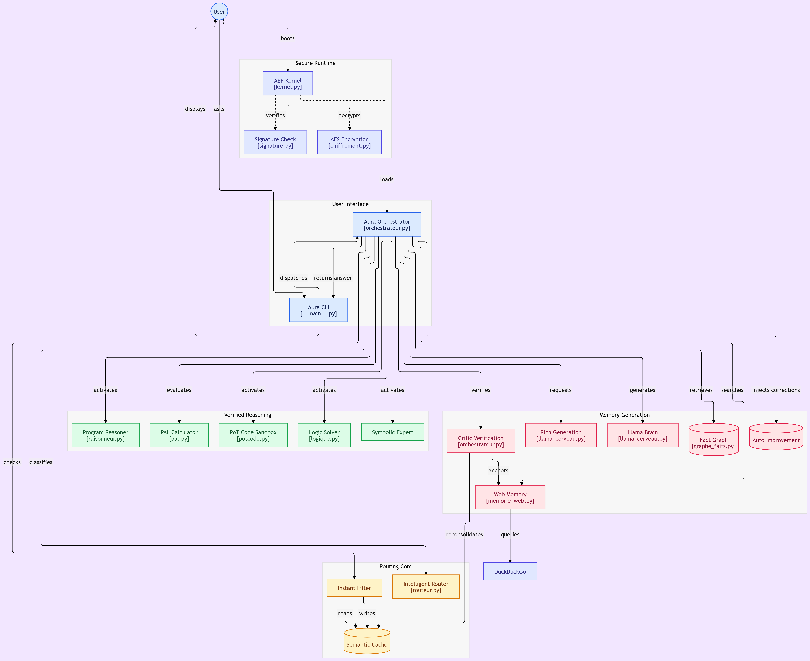

<div align="center">


**La réponse la plus rapide est celle qu'on n'a pas besoin de générer.**

Une IA 100 % locale, native-CPU, qui sépare le langage, les maths exactes et la
mémoire factuelle en modules spécialisés — au lieu de demander à un seul petit
modèle de tout faire (et d'halluciner quand il n'y arrive pas).

[](https://github.com/Simonc44/aura-1b/actions/workflows/tests.yml)
[](LICENSE)


<a href="https://github.com/Simonc44/aura-1b/stargazers"></a>


[Pourquoi](#-pourquoi-aura-1b) •
[Démarrage](#-démarrage-rapide) •
[Architecture](#️-architecture) •
[L'entraîner](#-entraîner-son-ia) •
[Format .aef](#-le-format-aef--distribution-chiffrée) •
[Benchmarks](#-benchmarks) •
[Feuille de route](#-feuille-de-route)

**Autres langues :** [English](README.md)

</div>

---

## 💡 Pourquoi Aura-1B ?

Sur une machine sans GPU, un LLM de 1B est lent (~14 tok/s) et hallucine.
Aura transforme cette faiblesse en règle de conception :

> **Le petit modèle propose. Le programme prouve.**
> Toute proposition non prouvée est vérifiée à une source ou refusée — jamais inventée.

Résultat : réponses instantanées (0–5 ms) sur 60–70 % des questions du
quotidien, maths et dates exactes, faits en temps réel, et un cerveau 1B
utilisé uniquement là où il compte.

| | Aura-1B | Un 8B typique sur le même PC |
|---|---|---|
| Question quotidienne | **0,0–2,3 s** | 30–60 s |
| Maths / dates / unités | **exact, vérifiable** | hallucine hors statistiques |
| Faits | **web en direct + preuve** | figés à la date d'entraînement |
| Empreinte RAM | **~1 Go** | ~4,5 Go |
| Savoir de niche & analyse profonde | ⚠️ limite du système | mieux — voir [limites honnêtes](#-limites-honnêtes) |

## 🚀 Démarrage rapide

### Une commande (Windows, PowerShell)

```powershell
powershell -ExecutionPolicy Bypass -File scripts/installer.ps1
```

Puis, dans une **nouvelle** fenêtre PowerShell :

```powershell
aura "quel est le carre de 7"     # -> 49
aura                              # chat interactif
```

L'installeur copie le paquet dans `%LOCALAPPDATA%\Aura`, crée le venv,
télécharge le cerveau (807 Mo, une seule fois) et enregistre la commande `aura`.

### Installation développeur

```bash
uv sync                                        # dépendances (llama.cpp inclus)
python scripts/telecharger_llama.py            # GGUF 807 Mo, une fois
uv run python -m aura --demo                   # démo : formule X³ + actu physique
uv run python -m aura "quelle est la capitale de la France ?"
uv run python -m aura --chat                   # chat avec mémoire
```

## 🏗️ Architecture



### Les piliers

| Pilier | Techno | Pourquoi |
|---|---|---|
| **Niveau 0** | Maths exactes via évaluateur AST sécurisé (jamais `eval()`) + cache sémantique de réponses (TF-IDF n-grammes de caractères, cosinus ≥ 0,85) | **La réponse la plus rapide est celle qu'on n'a pas besoin de générer.** Mesuré : ×3700 sur maths directes, ×7500 sur répétitions. Les questions contextuelles (« mon prénom… ») ne sont jamais mises en cache. |
| **Routeur** | TF-IDF + Régression Logistique (150 exemples) + prototypes cosinus + seuil de confiance | Classe toute question (fautes de frappe incluses) — pas de if/else codés en dur. Un routage peu confiant refuse de deviner. |
| **Cerveau** | **Llama 3.2 1B Instruct (Q4_K_M, 807 Mo)** via llama.cpp | Bon français ET anglais d'origine. Cerveau remplaçable : `AURA_GGUF=MINICPM` charge MiniCPM5-1B (OpenBMB) — mesuré **6/7 à 3,0 s vs 3/7 à 10,2 s** au même quiz, donc Llama reste le défaut. |
| **Expert symbolique** | Programmation génétique (gplearn), `pow` protégée | Trouve la loi **exacte** (`mul(mul(X0,X0),X0)` pour X³) — zéro hallucination, vérifiable. |
| **Mémoire web** | RAG DuckDuckGo (`ddgs`), sans clé API | Les paramètres restent libres pour le langage et la logique ; les faits restent à jour. |

### La couche d'intelligence vérifiée (pourquoi un 1B arrête d'halluciner)

| Mécanisme | Ce que ça corrige | Comment |
|---|---|---|
| **Vérification CRITIC** | réponses factuelles sorties de la mémoire | les réponses factuelles courtes sont régénérées ancrées sur une preuve web avant livraison ; la réponse vérifiée **remplace** l'ancienne au cache (reconsolidation) |
| **Graphe de faits** (`graphe_faits.py`) | savoir de niche hors-ligne | triplets `(sujet, relation, objet)` en JSONL, recherche par couverture multi-mots (multi-hop naturel). Nourri **uniquement** de contenus vérifiés web + ton `knowledge.jsonl` (223 entrées) — il ne peut pas contenir d'hallucination |
| **PAL** (`pal.py`) | dates, unités, pourcentages composés | « 15% de 200 plus 30% de 100 » → 60, « 100 f en c », « combien de jours jusqu'au 25 décembre » — déterministe, < 1 ms |
| **Program-of-Thoughts** (`raisonneur.py`) | énigmes chiffrées | le 1B écrit des lignes `ETAPE 1/ETAPE 2`, l'AST sécurisé évalue chaque étape : « Léo a 4 ans, Marie le double, Paul 3 de plus » → **11, chaque étape vérifiée** |
| **Solveur logique** (`logique.py`) | logique sans nombres (chevaliers & menteurs, attributions) | le 1B formalise `ENTITES/DOMAINE/CONDITION`, un mini-SAT en pur Python déduit exactement ; les contraintes inventées sont détectées → repli propre |
| **PoT-code** (`potcode.py`) | génération de code cassé | le 1B écrit une fonction + des asserts, une sandbox (builtins restreints + budget d'instructions via `settrace`) exécute tout ; un assert raté = le code n'est jamais livré |
| **Agents cognitifs** (`agents.py`) | fragilité du petit modèle | 5 agents légers orchestrent le 1B : planificateur (les tâches complexes sont découpées en 2-3 étapes avant rédaction), compresseur RAG (seules les 3 phrases web utiles atteignent le LLM), rédacteur (retrait des tics de langage du 1B), debugger récursif (le code raté est relancé avec l'erreur exacte de la sandbox, max 3), masqueur de personnalité (prompt système adapté à la catégorie routée) |
| **Hot-swap LoRA** (`adaptateurs.py`) | un cerveau, une spécialité | permutation dynamique d'adaptateurs via la C-API llama.cpp : le GGUF de base est chargé une fois, les adaptateurs par catégorie (~10-40 Mo, entraînés sur Colab avec PEFT) se montent/démontent sans recharger. Registre LRU en mémoire (défaut 1 adaptateur = empreinte quasi nulle). `AURA_ADAPTATEURS=1` pour activer |
| **Auto-amélioration** | erreurs répétées | les mauvaises réponses enregistrées via `enregistrer_correction()` sont injectées dans les futurs prompts — la même erreur n'est plus jamais faite |

### Mode riche (qualité de rédaction)

Les questions ouvertes (≥ 9 mots ou *explique/analyse/compare…*) déclenchent
un pipeline en 3 étapes :
1. **Recherche enrichie** — double requête (faits + analyse) + **lexique** du domaine injecté en mots-clés.
2. **Chaîne de pensée masquée** — planification dans des balises `<thinking>`, retirée par regex ; l'utilisateur ne voit que la réponse soignée.
3. **Génération par sections** — chaque partie du plan (contraint par GBNF) est rédigée séparément, avec mémoire des sections précédentes (StoryWriter-lite).

Coût : ~2× la latence — réservé aux questions qui le méritent. Mesuré sur la
machine de référence : fait 0,3 s, maths 0,0 s, dissertation riche 66 s.

## 🎓 Entraîner son IA

Aura s'améliore par le feedback, sans réentraînement. Trois leviers, du plus
simple au plus profond :

**1. Corriger une mauvaise réponse** — stockée et injectée dans les futurs prompts :

```python
from aura import autoamelioration
autoamelioration.enregistrer_correction(
    "quel est le carre de 5", "20",   # sa mauvaise réponse
    "25",                             # la bonne
    "math")
```

**2. Nourrir le graphe de faits** — tout ce qui est vérifié web est appris
automatiquement ; ajoute des faits choisis :

```python
from aura import graphe_faits
graphe_faits.ajouter("Canberra", "est la capitale de", "l'Australie",
                     source="manuel")
```

Ou en masse : `python scripts/nourrir_graphe.py knowledge.jsonl`
(les entrées « identité » sont écartées, santé/droit marquées *info générale*).

**3. Le laisser répéter** — les réponses vérifiées rejoignent le cache
sémantique : redemande demain, la réponse revient en ~1 ms. Les entrées
fausses sont remplacées par reconsolidation (`mettre_a_jour`), jamais doublées.

> [!TIP]
> Le graphe de faits n'apprend que de contenus **vérifiés web** — de par sa
> conception, il ne peut pas mémoriser une hallucination.

## 🔒 Le format `.aef` + distribution chiffrée

Tout le système tient dans **un seul fichier binaire scellé** :

```text
aura_system.aef (807 Mo, monolithique)
├── HEADER (148 o)   magic "AURA" · version · build · config CPU · 3× SHA-256
├── CONFIG (LZMA)    réglages auto-tunés compilés pour la machine cible
├── CODE (ZIP)       tout le paquet python aura/ (vérifié par hash)
└── WEIGHTS (brut)   le GGUF à l'octet près (chargé directement, zero-copy)
```

**Intégrité** : un octet altéré n'importe où → boot refusé (SHA-256 sur la
config, le code et les poids — testé). **Signature Ed25519** optionnelle.

```bash
uv run python scripts/construire_exe.py            # -> dist/Aura.exe (~8,6 Mo)
uv run python scripts/forger_aef.py --chiffrer     # -> aura_system.aef.enc (AES-256-GCM)
```

Sur la machine utilisateur (le secret livré à part, jamais dans le fichier) :

```powershell
Aura.exe aura_system.aef.enc "ta question"         # déchiffre, vérifie, répond
Aura.exe --cache "ta question"                      # runs suivants : démarrage instantané
```

> [!IMPORTANT]
> AES-256-GCM + PBKDF2 (600 000 itérations) : sans le secret, la charge utile
> est indistinguable d'un bruit aléatoire, et toute altération casse le
> déchiffrement. Note honnête : cela bloque la copie passive — pas un
> ingénieur inverse déterminé.

## ⚙️ Auto-tuning matériel & GPU

Aura inspecte la machine (CPU, cœurs, RAM, AVX2) et dérive les réglages
optimaux :

```bash
python -m aura.profil_materiel
```

| Machine | Réglages dérivés |
|---|---|
| RAM ≥ 6 Go | ctx 1536, batch 768, threads = tous les cœurs logiques |
| RAM < 6 Go | ctx 1024, batch 512 (ajustement garanti) |

GPU : build CUDA/Vulkan + GPU dédié → offload complet ; CPU seul → 0
(optimal ici : 13,4 tok/s mesurés). Forcer le CPU avec `AURA_GPU=0`.

## 📊 Benchmarks

| Cerveau | Vitesse | Français | Chargement |
|---|---|---|---|
| **Llama 3.2 1B Q4_K_M** (défaut) | **13,4 tok/s** | ✅ instruction-tuned | 3,4 s |
| MiniCPM5-1B Q4_K_M (option, `AURA_GGUF=MINICPM`) | ~11 tok/s + tokens de réflexion | ✅ | 3,2 s |
| Qwen 2.5 1.5B (retiré) | 12,1 tok/s | ✅ | — |
| Mamba-790M / RWKV-430M (retirés) | 1,5-1,8 tok/s | ❌ modèles de base | 30-400 s |

Face-à-face au même quiz (`scripts/comparer_cerveaux.py`) : **Llama 6/7 à
3,0 s/réponse** vs **MiniCPM5 3/7 à 10,2 s/réponse** — MiniCPM5 est un cerveau
*« thinking-first »* : sans sa phase native `<think>` il sous-performe, avec
(`AURA_THINK=1`) il est 3× plus lent. L'orchestration d'Aura raisonne déjà par
ses experts : un cerveau à réponse directe gagne ici.

Quiz au niveau système vs Qwen 2.5 1.5B : **Aura 5/5 vs 4/5** (maths exactes,
faits en temps réel, mémoire) — l'organisation bat le plus gros cerveau sur
les questions vérifiables.

### Limites honnêtes

> [!NOTE]
> Sur les questions **vérifiables** (maths, faits, dates, format), Aura-1B bat
> des modèles plus gros par construction — eux devinent, lui prouve. Sur
> **l'analyse profonde, le savoir de niche et la logique abstraite**, un 8B
> fine-tuné gagne encore : ces compétences vivent dans les poids, et c'est la
> cible de la feuille de route.

## 🗺 Feuille de route

- [x] Niveau 0 : maths exactes, cache sémantique, PAL
- [x] Couche d'intelligence vérifiée : CRITIC, graphe de faits, PoT, solveur logique, PoT-code
- [x] Agents cognitifs : planificateur, compresseur RAG, rédacteur, debugger récursif, masqueur de personnalité
- [x] Hot-swap LoRA dynamique : adaptateurs par catégorie montés sur le contexte vivant (C-API), registre LRU en mémoire
- [x] Format scellé `.aef` + Ed25519 + distribution chiffrée
- [x] CI verte (matrices OS/py + chaîne `.aef` + syntaxe installeur)
- [ ] **Fine-tune LoRA** sur Colab — profondeur de raisonnement, taille 807 Mo inchangée
- [ ] **Édition de faits MEMIT** — corriger le savoir de niche directement dans les poids
- [ ] **lm-evaluation-harness** — scores publics et comparables du cerveau
- [ ] Sortie Hugging Face (`.aef` + `Aura.exe` + model card)

## 🧪 Tests & qualité

```bash
uv run pytest -q        # 173 tests (CI : 167 + 6 sautés — pas de GGUF en CI)
uv run mypy aura/       # 0 erreur
```

La CI (GitHub Actions) tourne sur **Ubuntu + Windows** (Python 3.11/3.12),
revalide toute la chaîne `.aef` (forge → signature Ed25519 → boot → détection
d'altération) sur Linux, et vérifie la syntaxe de l'installeur PowerShell.

## 📄 Licence

GPLv3 — voir [LICENSE](LICENSE). Copyleft : toute dérivée de l'architecture multi-agents d'Aura reste open-source aux mêmes termes.
